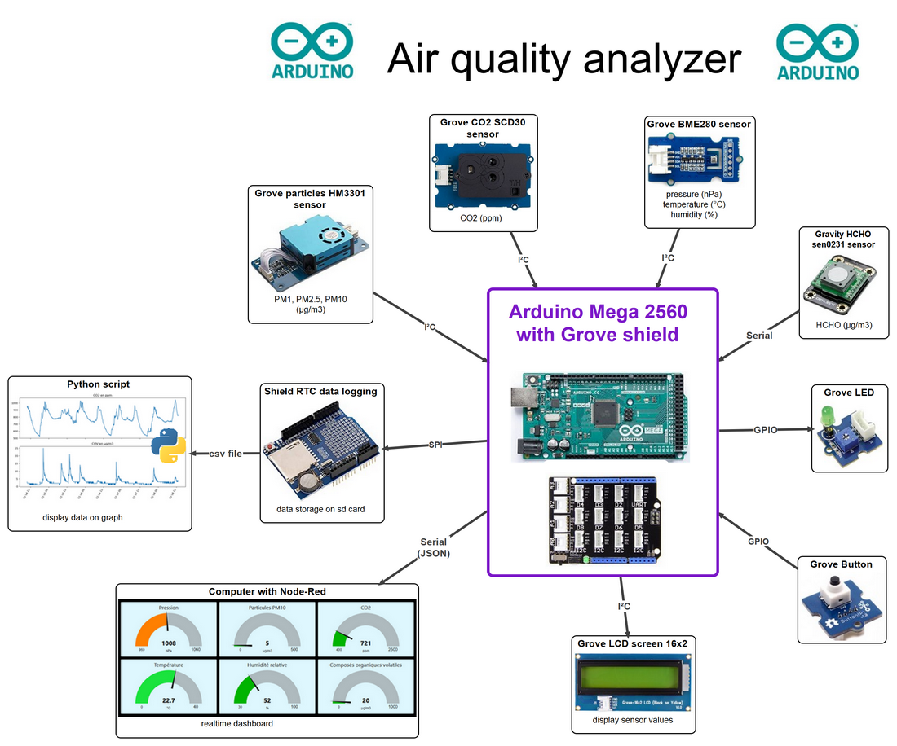
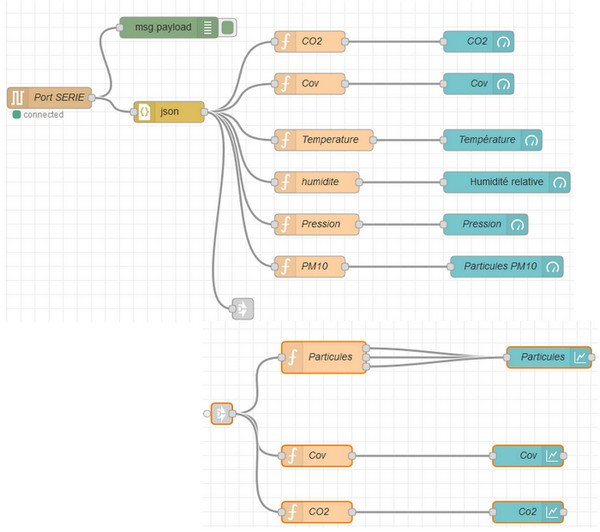

# Arduino  air quality analyser

## The project:
This is a air analyser programmed with Arduino. It can be used to study air quality.

It measures temperature (°C), pressure (hPa), Humidity (%), CO2 (ppm), volatile organic compounds = VOC and specialy HCHO (µg/m3), and particles PM1 PM2.5 and PM10 (µg/m3).

Data can be,  displayed on LCD screen, displayed on computer screen with a Node-Red dashboard, stored on sd card then displayed on graph with python script.

It uses Seed studio Grove shield to simplify component connection.

## Connection explanation:
* Grove shield is plugged on Mega board then sd shield is plugged en Grove sheield.

* SD Shield is attached to SPI bus as follows:
    * MOSI - pin 11 on sd shield is connected with wire on  pin 51 on  Mega
    * MISO - pin 12 on sd shield is connected with wire on  pin 50 on Mega
    * CLK - pin 13 on sd shield is connected with wire on  pin 52 on Méga
    * CS  - depends on your SD card shield (pin 10 on my shield).
    
* SD shield is attached to I2C  bus for RTC module as follows:
    * sda pin on sd shield is connected with jumper to  A4 pin on sd shield
    * scl pin on sd shield is connected with jumper to  A5 pin on sd shield
      
* HCHO  sensor is connected on pin 19 (Rx1) on Mega 

* CO2 sensor, lcd display, BME280 sensor and particles sensor are attached to I2C plugs en Grove Shield

* Button is connected on D2 plug on Grove shield

* LED is connected on D3 plug on Grove shield

## Installation:
- Install all librarys on Arduino.
- You may need to set time and date on RTC module with [RTC_set_time.ino](RTC_set_time.ino) sketch.
- Upload version1.ino sketch on to Mega board.

## Functions:
When the program is starting, you have to make a choice between three functions of the analyser:
* display sensor values on the LCD screen;
* data logging on sd card;
* send data to Node-Red thrue serial link.

I use an automat with button as follows to make this choice.

## Node-Red:
- See here ton install Node-Red on windows:
https://nodered.org/docs/getting-started/windows  ; https://nodered.org/docs/getting-started/local

- Mega board is sending data with JSON format thrue serial link to Node-Red.
- Import flows with  [flows.json-1.txt](flows.json-1.txt)
- Don't forget to change the Com port name in Serial node.
- You can see flows below

- Then result on realtime dashboard. I use this dashboard to display data in classroom with my students.

## Python scripts:
 I use python script to display on graph the data stored on sd card.
 
* First script  [Graph from csv.py] (Python scripts/Graph from csv.py) displays one graph per data per window.
* Second script [Graph from csv_1graph.py] (Python scripts/Graph from csv_1graph.py) displays many graphs on one window. 
 

